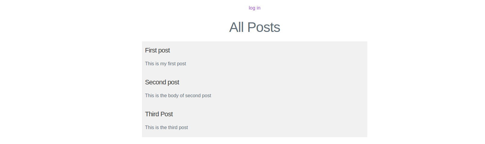
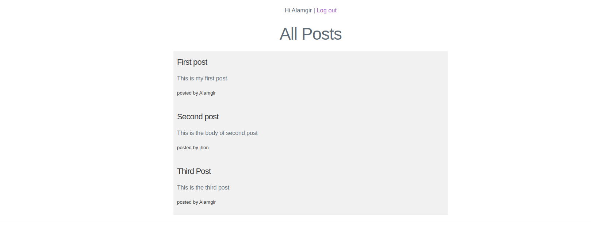

# Project: Members Only

In this project, I build an Blog Post App where your members can write anonymous posts. If logged-in, members can see who the author of a post is but, outside, they can only see the story and wonder who wrote it.

### Clone the project

- Clone the repo and run the app.

```bash
$ git clone https://github.com/M-Alamgir/members-only.git
$ cd members-only

```

### Run bundle install and migrate as follows:

```bash
bundle install

rails db:migrate
```

### Run the rails console

```bash
rails console

```

## Creating a new User

``` bash

> user = User.new(name: "Mark", email: "Mark@email.com", password: "password")
> user.authenticate("wrongpassword")
=> false
> user.authenticate("password")
=> #<User id: nil, name: "Mark", email: "Mark@email.com", created_at: nil, updated_at: nil, password_digest: [FILTERED]>

```

## Screenshots

### View all Posts (Without Login)

`http://localhost:3000/` or `http://localhost:3000/posts`


### View all Posts (With Login - Author name)

`http://localhost:3000/` or `http://localhost:3000/posts`


### Login page

`http://localhost:3000/login`


### Create New Post

`http://localhost:3000/posts/new`


## Ruby version

    ruby 2.7.0p0

## Rails version

    Rails 6.1.3.1

👤 **Alamgir**

- GitHub: [@M-Alamgir](https://github.com/M-Alamgir)
- Twitter: [@Alphacrescent1](https://twitter.com/Alphacrescent1)

## Acknowledgment
The resources we have used to develop our project:

- [Odin-project](https://www.theodinproject.com/paths/full-stack-ruby-on-rails/courses/ruby-on-rails/lessons/authentication#project-2-members-only)

## Show your support

Give ⭐ Star me on GitHub — it helps!

## 🤝 Contributing

Contributions, issues, and feature requests are welcome!

## 📝 License

This project is [MIT](https://opensource.org/licenses/MIT) licensed. 